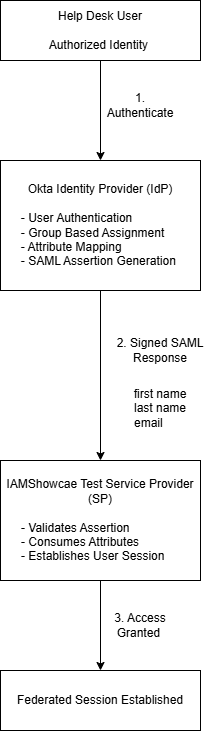
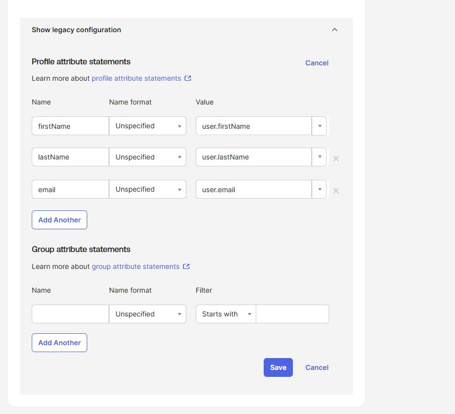
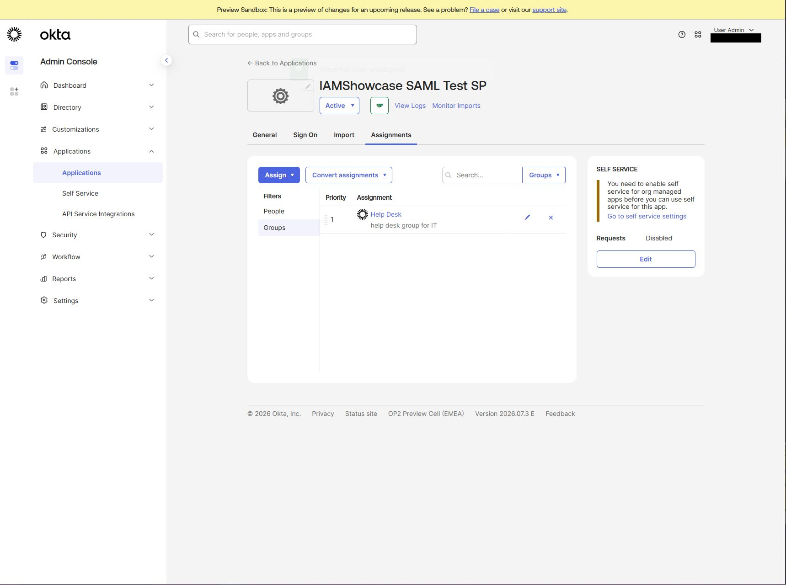
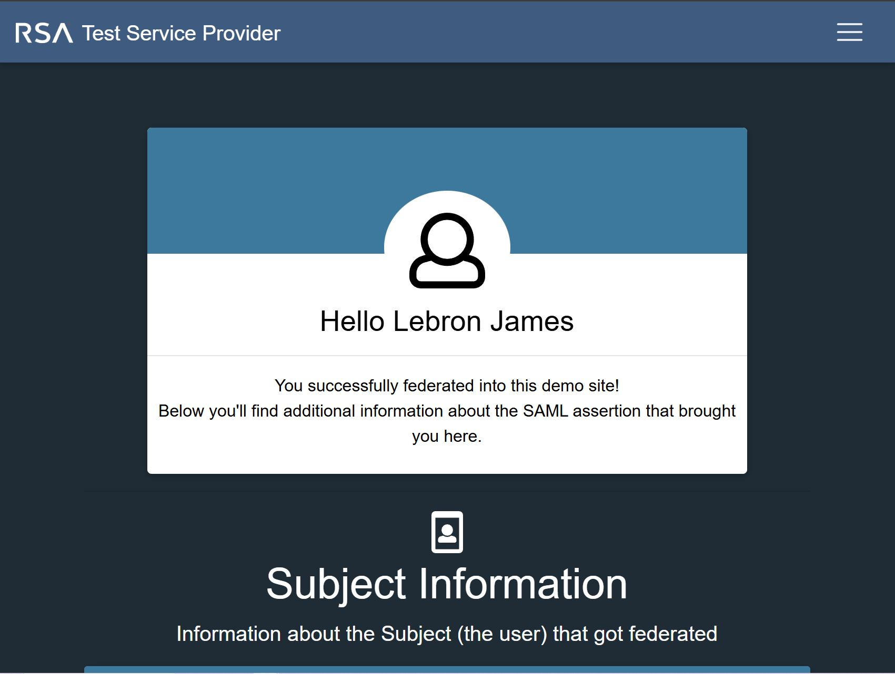
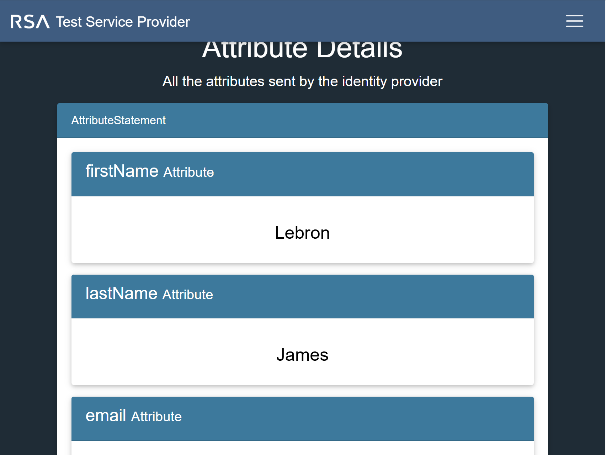
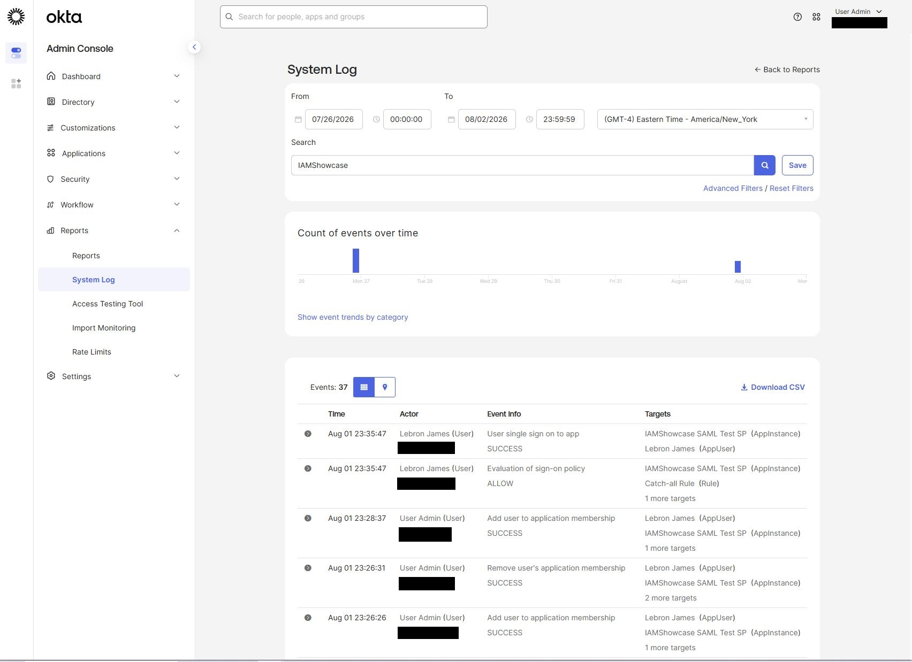
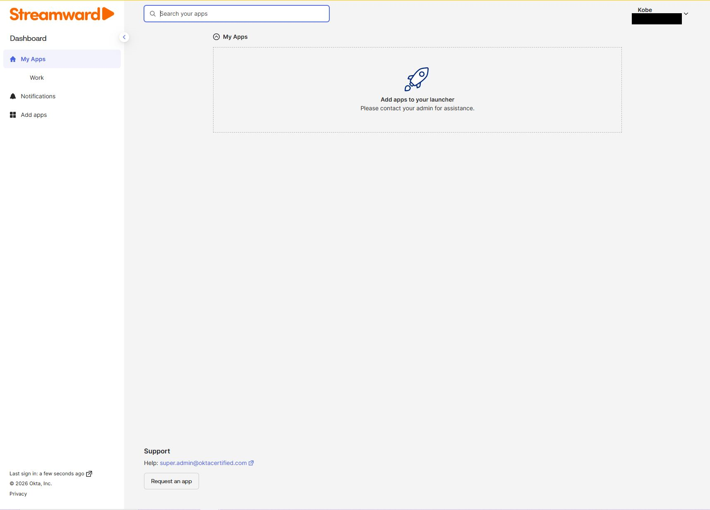

# Okta SAML 2.0 SSO Integration Lab

## Project Overview

This hands-on Identity and Access Management (IAM) lab demonstrates the implementation of SAML 2.0 Single Sign-On (SSO) between Okta and a test Service Provider.

The project simulates an enterprise application onboarding scenario in which Okta serves as the Identity Provider (IdP) and IAMShowcase serves as the Service Provider (SP).

The implementation includes Service Provider metadata analysis, SAML application configuration, profile attribute mapping, group-based application access, authentication testing, and validation through the Okta System Log.

---

## Architecture

### Authentication Flow

1. An authorized Help Desk user authenticates to Okta.
2. Okta verifies the user's application entitlement through group-based assignment.
3. Okta generates a signed SAML response containing the configured identity attributes.
4. The SAML response is sent to the Service Provider's Assertion Consumer Service (ACS).
5. The Service Provider validates the assertion and establishes a federated session.

---

## Business Scenario

An organization requires SSO access to a third-party application for members of its Help Desk team.

Rather than assigning application access directly to individual users, access is managed through group membership.

Three functional groups were created within the identity environment:

- Help Desk
- Finance
- Accounting

Only the **Help Desk** group was assigned to the SAML application.

This provides a scalable access model:

`User → Group Membership → Application Assignment → SAML SSO`

Finance and Accounting users were intentionally left without application assignment to validate access controls.

---

## Technologies and Concepts

- Okta
- SAML 2.0
- Single Sign-On (SSO)
- Identity Provider (IdP)
- Service Provider (SP)
- Assertion Consumer Service (ACS)
- SAML Metadata
- SAML Attribute Statements
- Group-Based Application Assignment
- RSA-SHA256
- SHA-256
- Okta System Log
- Identity and Access Management (IAM)

---

## Implementation

### 1. Service Provider Metadata Analysis

Service Provider metadata was obtained from the IAMShowcase test Service Provider.

The metadata was reviewed to identify the information required for the Okta integration, including:

- Service Provider Entity ID
- Assertion Consumer Service (ACS) URL
- Supported NameID format
- Assertion signing requirements

This information was then used to configure the custom SAML application in Okta.

---

### 2. SAML Application Configuration

A custom SAML 2.0 application integration was created in Okta.

The integration was configured with:

- **NameID Format:** EmailAddress
- **Application Username:** Email
- **Response:** Signed
- **Assertion Signature:** Signed
- **Signature Algorithm:** RSA-SHA256
- **Digest Algorithm:** SHA256

---

### 3. Attribute Mapping

Profile Attribute Statements were configured to transmit identity information from Okta to the Service Provider.

| SAML Attribute | Okta Expression |
|---|---|
| firstName | `user.firstName` |
| lastName | `user.lastName` |
| email | `user.email` |

These mappings allow user profile information stored within Okta to be included in the SAML assertion.

---

### 4. Group-Based Application Access

Application access was assigned to the **Help Desk** group rather than directly to individual users.

This demonstrates a scalable entitlement model in which application access can be controlled through group membership.

Users added to the authorized group can inherit application access without requiring individual application assignments.

---

## SAML Federation Testing

### Successful Authentication

An authorized Help Desk test user authenticated to Okta and launched the IAMShowcase application from the Okta End-User Dashboard.

Okta generated the SAML response and sent it to the Service Provider.

The Service Provider successfully validated the assertion and established the federated session.

**Result: PASS**

---

### Attribute Validation

The Service Provider confirmed receipt of the profile attributes configured in Okta.

The assertion successfully transmitted:

- firstName
- lastName
- email

**Result: PASS**

---

## Okta System Log Validation

The authentication event was reviewed through the Okta System Log to validate the transaction from the Identity Provider side.

The logs recorded:

- **User single sign on to app — SUCCESS**
- **Evaluation of sign-on policy — ALLOW**

This provided IdP-side confirmation that the user successfully accessed the SAML application and passed the applicable sign-on policy evaluation.

---

## Negative Access Testing

A second test identity outside the authorized Help Desk group was used to validate the application's group-based access model.

The user successfully authenticated to Okta but did not receive the IAMShowcase application assignment.

As expected, the SAML application was absent from the user's End-User Dashboard.

**Result: PASS**

This test confirmed that authentication to Okta alone did not provide access to the application. Application entitlement was controlled through group membership.

---

## Test Results

| Test Case | Expected Result | Result |
|---|---|---|
| Help Desk application assignment | Application available | PASS |
| SAML federation | Federated session established | PASS |
| Profile attribute transmission | Attributes received by SP | PASS |
| Okta System Log | SSO SUCCESS / Policy ALLOW | PASS |
| Unauthorized user | Application unavailable | PASS |

---

## Security Considerations

Several IAM and security principles were incorporated into the implementation:

**Group-Based Access Control**  
Application access was managed through group membership rather than individual assignment.

**Least Privilege**  
Only the group requiring access was assigned to the application.

**Signed Assertions**  
SAML assertions were digitally signed so the Service Provider could validate their origin and integrity.

**Attribute Minimization**  
Only the identity attributes required for the lab were transmitted to the Service Provider.

**Logging and Monitoring**  
Authentication activity was validated using the Okta System Log.

Additional details are available in [Security Considerations](docs/security-considerations.md).

---

## Troubleshooting

During implementation, the expected Profile Attribute Statements configuration was not available during the initial SAML application creation workflow.

After reviewing the application's post-creation **Sign On** settings, the Profile Attribute Statements configuration was located and the required mappings were successfully added.

This reinforced the importance of understanding differences between Okta administrative interfaces and releases rather than relying solely on a specific UI workflow.

Additional details are documented in [Troubleshooting](docs/troubleshooting.md).

---

## Documentation

Additional project documentation:

- [Implementation Guide](docs/implementation-guide.md)
- [Testing and Validation](docs/testing-validation.md)
- [Security Considerations](docs/security-considerations.md)
- [Troubleshooting](docs/troubleshooting.md)

---

## Skills Demonstrated

This project demonstrates hands-on experience with:

- Configuring SAML 2.0 SSO integrations
- Interpreting Service Provider metadata
- Identifying ACS and Entity ID requirements
- Configuring an Okta Identity Provider
- Mapping identity attributes into SAML assertions
- Managing application access through Okta groups
- Testing authorized and unauthorized access
- Validating federated authentication
- Reviewing authentication activity through the Okta System Log
- Applying least-privilege and group-based access principles
- Documenting IAM implementation and testing procedures

---

## Project Scope

This project was completed in a controlled lab environment using fictional test identities and a test Service Provider. Screenshots have been sanitized to remove unnecessary tenant-specific information.
